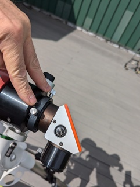

# Lunt Solar Scope Setup

## Prerequisites
* Mount is set up
* OTA installed in mount

## Setup Steps

* The __draw tube__ (the moving part of the OTA) will need to be
  extended in order to achieve focus.
    - Locate the black knurled __draw tube ring__ near the diagonal.
    - Slightly loosen the two knurled silver __draw tube screws__ in the
      draw tube ring. This allows the diagonal to move freely.
    - Extend the diagonal an inch or two away from the scope.
    - Note the coloring of the diagonal input tube.  Near the diagonal it is
      "bronze".  Farther away, it is black.
    - Align the bronze/black boundary with the end of the draw tube ring.
      IOW, hide all of the black but none of the gold.
    - Tighten the two draw tube screws.
    - Hint: this is how you adjust the orientation of the eyepiece while
      observing.

* Insert the 25mm eyepiece.
* Unscrew the metal lens cover and store it in the aluminum case.
* The scope must now be balanced.  This is discussed in the section on mounts.

The solar scope is now ready for alignment and use.
